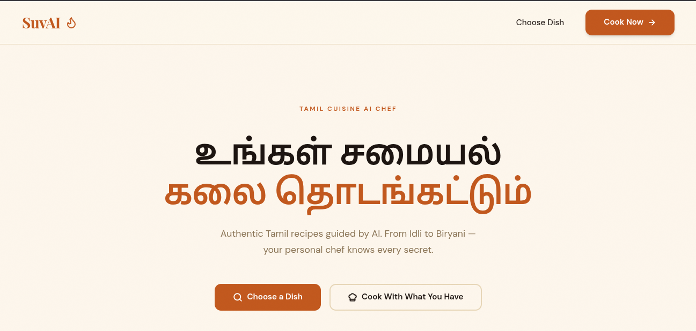
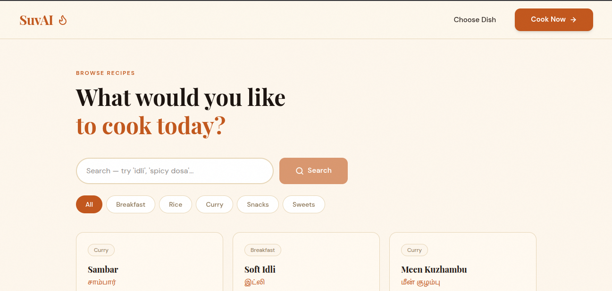
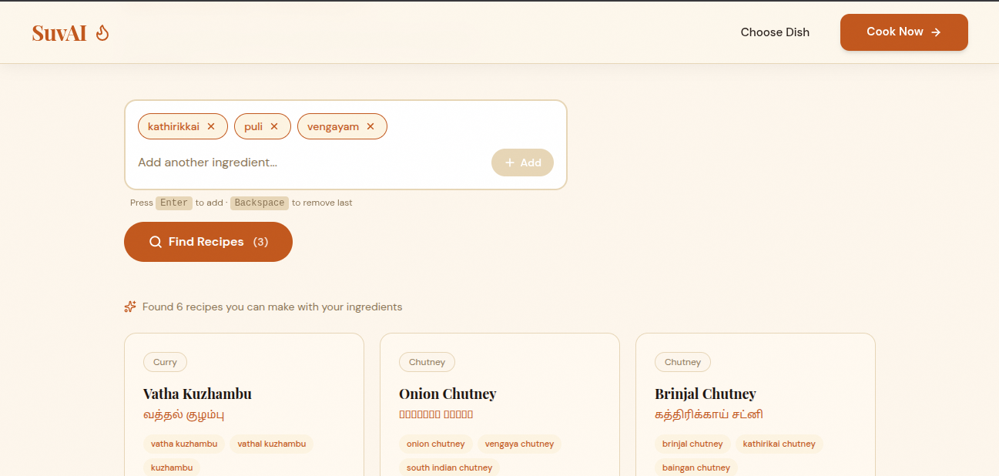
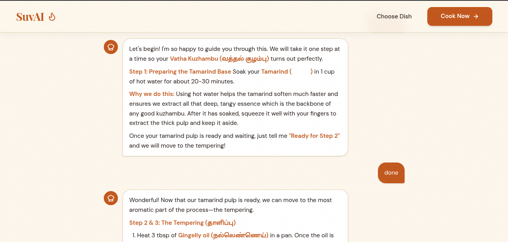

# SuvAI Your Tamil AI Chef

[](https://suvai-g4.vercel.app)
[](https://github.com/abdkhaleel/suvai/blob/master/LICENSE)
[](https://ai.google.dev/gemma)
[](https://www.kaggle.com/competitions/gemma-4-good-hackathon)

> **SuvAI** is a Tamil cuisine AI chef built for the **Gemma 4 Good Hackathon**. It combines **Gemma 4 31B-IT** with a custom RAG pipeline over 80+ authentic Tamil recipes to guide anyone from beginners to home cooks through the art of Tamil cooking in their own language and context.

---

## The Problem

Tamil culinary knowledge is scattered across blogs, YouTube videos, and family notes. For millions of Tamil speakers and diaspora communities, finding a recipe is easy but understanding *why* a step matters, what substitutes work, or how to cook with what's already in the pantry is hard. Most AI assistants are generic, Western-centric, and don't understand regional ingredients like *kathirikkai* (eggplant) or *kothamalli* (coriander).

## The Solution

SuvAI is a specialized, retrieval-augmented cooking assistant that acts as a warm Tamil chef named **Suvai**.

- **Mode 1 Choose a Dish:** Search or browse 80+ Tamil recipes across 8 categories (breakfast, rice varieties, kuzhambu, kootu, chutneys, snacks, sweets, and drinks).
- **Mode 2 Cook With What You Have:** Enter ingredients in English or Tamil (e.g., *kathirikkai*, *kothamalli*). SuvAI resolves synonyms, searches the vector database, and suggests what you can actually cook today.

Both modes lead to a conversational chat where **Gemma 4 31B-IT** guides you step-by-step, explains the science behind each step, suggests substitutions, and gently redirects off-topic questions back to cooking.

---

## Live Demo

**[https://suvai-g4.vercel.app](https://suvai-g4.vercel.app)**

Try it: search for *"Masala Dosa"* or enter *"kathirikkai, kothamalli"* in ingredient mode.

---

## Screenshots

### Home Page


### Mode 1 Choose a Dish


### Mode 2 Cook With What You Have


### Chat with Suvai


---

## Features

| Feature | Description |
|---------|-------------|
| **Dual-Mode Discovery** | Search by dish name *or* by available ingredients |
| **Tamil Synonym Resolution** | 50+ ingredient synonyms mapped (e.g., *kathirikkai* → eggplant) |
| **RAG-Powered Context** | Every chat response is grounded in the full recipe retrieved from Supabase pgvector |
| **Streaming Responses** | Real-time, token-by-token streaming from Gemma 4 for a natural conversational feel |
| **Step-by-Step Guidance** | Chef explains *why* each step matters, not just *what* to do |
| **Substitution Intelligence** | 24 ingredient substitutions built-in; Gemma 4 suggests more contextually |
| **Mobile-First Design** | Responsive navbar, touch-friendly inputs, and readable chat on all screen sizes |
| **Warm Tamil Persona** | Suvai speaks like a patient home chef, using Tamil names naturally |

---

## Tech Stack

| Layer | Technology |
|-------|------------|
| **Frontend** | Next.js 16, React, Tailwind CSS, Playfair Display + DM Sans |
| **AI Model** | Gemma 4 31B-IT via `@google/genai` SDK (`generateContentStream`) |
| **Embeddings** | `gemini-embedding-001` (3072 dimensions) |
| **Vector Database** | Supabase PostgreSQL + pgvector extension |
| **RAG Pipeline** | Custom cosine-similarity search with query embedding + synonym resolution |
| **Deployment** | Vercel |
| **Dataset** | 80+ structured Tamil recipes with ingredients, steps, tips, and variations |

---

## Architecture

```
User Query
    │
    ├─► Mode 1 (Dish Search) ──► Embedding ──► Supabase pgvector (cosine sim, threshold 0.592666625977)
    │
    └─► Mode 2 (Ingredients) ──► Synonym Resolver ──► Embedding ──► Supabase pgvector (threshold 0.621875)
                                              │
                                              ▼
                                    Retrieved Recipe (full context)
                                              │
                                              ▼
                              ┌─────────────────────────────┐
                              │  Gemma 4 31B-IT System      │
                              │  Prompt + Recipe Context    │
                              │  + Conversation History     │
                              │  ──► generateContentStream  │
                              └─────────────────────────────┘
                                              │
                                              ▼
                                    Streaming Markdown Response
```



### How RAG Works

1. **Query Embedding:** The user's dish name or ingredient list is converted to a 3072-dimension vector using `gemini-embedding-001`.
2. **Vector Search:** A custom SQL function `match_recipes()` queries the `recipes` table using cosine similarity (`<=>` operator) via pgvector.
3. **Threshold Tuning:** Dish mode uses `0.592666625977` to block irrelevant queries (e.g., "pizza" returns nothing). Ingredient mode uses `0.621875` to be more permissive with partial matches.
4. **Synonym Resolution:** For ingredient mode, Tamil names are first resolved through the `synonyms` table before embedding.
5. **Context Injection:** The full recipe (ingredients, steps, tips, variations) is fetched by ID and injected into every chat prompt as system context, along with the full conversation history.

### Why Gemma 4?

We chose **Gemma 4 31B-IT** because it is an open, frontier-level model that can run both via API and locally. For SuvAI, it provides:

- **Cultural Fluency:** The model naturally understands and generates Tamil culinary context when guided by the system prompt.
- **Streaming Inference:** `generateContentStream` delivers a real-time conversational experience without perceptible latency.
- **Open Model:** Powered by Gemma 4 31B-IT via Google AI Studio API. Gemma's open weights also enable future local deployment for offline or privacy-sensitive use cases.
- **Function-Calling Ready:** Tool stubs defined for future pantry scanner and meal planner integration. Not yet active.

---

## Dataset

The dataset contains **80+ authentic Tamil recipes** structured as JSON and stored in Supabase.

| Category | Count |
|----------|-------|
| Breakfast / Tiffin | 10+ |
| Rice Varieties | 10+ |
| Kuzhambu & Curries | 10+ |
| Kootu & Poriyal | 10+ |
| Chutneys | 10+ |
| Snacks | 10+ |
| Sweets | 10+ |
| Drinks | 10+ |

**Supporting tables:**
- `synonyms`: 50 Tamil ingredient synonyms with standard names, transliterations, and aliases.
- `substitutions`: 24 ingredient substitutions with Tamil names and JSON-structured alternatives.

**Pipeline:** `raw .txt` → Gemini Flash conversion → `structured .json` → `node dataset/insert.js` (auto-generates embeddings, skips duplicates).

---

## Getting Started

### Prerequisites

- Node.js 22+
- A Google AI Studio API key (for Gemma 4 and embeddings)
- A Supabase project with pgvector enabled

### Installation

```bash
# 1. Clone the repository
git clone https://github.com/abdkhaleel/suvai.git
cd suvai

# 2. Install dependencies
npm install

# 3. Set up environment variables
cp env.example  .env
# Edit  .env with your keys (see Environment Variables below)

# 4. Run the development server
npm run dev
```

Open [http://localhost:3000](http://localhost:3000) to view the app.

### Environment Variables

Create ` .env` in the project root:

```env
GEMINI_API_KEY=your-google-ai-studio-key
SUPABASE_URL=https://your-project.supabase.co
SUPABASE_KEY=your-service-role-key
```

---

## Project Structure

```
suvai/
├── app/
│   ├── page.tsx                 # Home with two mode cards
│   ├── choose/page.tsx          # Mode 1: search + recipe cards
│   ├── cook/page.tsx            # Mode 2: ingredient input
│   ├── chat/page.tsx            # Chef chat (Suspense wrapped)
│   ├── global.css              # CSS variables + animations
│   ├── layout.tsx               # Fonts + metadata
│   └── api/
│       ├── gemma/route.ts       # Gemma 4 streaming endpoint
│       ├── rag/route.ts         # RAG search endpoint
│       └── recipe/route.ts      # Fetch recipe by ID
├── components/
│   └── Navbar.tsx               # Responsive with hamburger menu
├── lib/
│   ├── supabase.ts              # Supabase client
│   ├── embedding.ts             # getEmbedding() function
│   ├── synonyms.ts              # Tamil name resolver
│   └── rag.ts                   # searchByDish(), searchByIngredients(), getRecipeById()
├── dataset/
│   ├── raw/                     # .txt recipe files
│   ├── structured/              # .json recipe files
│   ├── synonyms.json            # 50 Tamil ingredient synonyms
│   ├── substitutions.json       # 24 ingredient substitutions
│   └── insert.js                # Inserts recipes + embeddings to Supabase
├── images/                      # Screenshots and design assets
└── README.md
```

---

## API Routes

| Endpoint | Method | Payload | Response |
|----------|--------|---------|----------|
| `/api/gemma` | POST | `{ message, recipeContext, history }` | `ReadableStream` (text/plain chunks) |
| `/api/rag` | POST | `{ mode, query?, ingredients?, matchCount? }` | JSON array of matched recipes |
| `/api/recipe` | GET | `?id=<uuid>` | Full recipe with joined ingredients |

---

## Roadmap

- [x] Core chat with Gemma 4 streaming
- [x] RAG pipeline with pgvector
- [x] Tamil synonym resolution
- [x] Mobile-responsive design
- [x] 80+ recipe dataset
- [ ] Voice input for ingredient mode [post-hackathon]
- [ ] Pantry scanner (camera integration) [post-hackathon]
- [ ] Weekly meal planner [post-hackathon]
- [ ] Persistent chat history (localStorage) [post-hackathon]

---

## License

This project is licensed under the **MIT License** see the [LICENSE](https://github.com/abdkhaleel/suvai/blob/master/LICENSE) file for details.

---

## Acknowledgments

Built for the **Gemma 4 Good Hackathon** (May 2026). Submitted under the **Digital Equity & Inclusivity** track for preserving and democratizing Tamil culinary heritage through open, accessible AI.

Powered by [Gemma 4](https://ai.google.dev/gemma), [Next.js](https://nextjs.org), [Supabase](https://supabase.com), and [Vercel](https://vercel.com).
